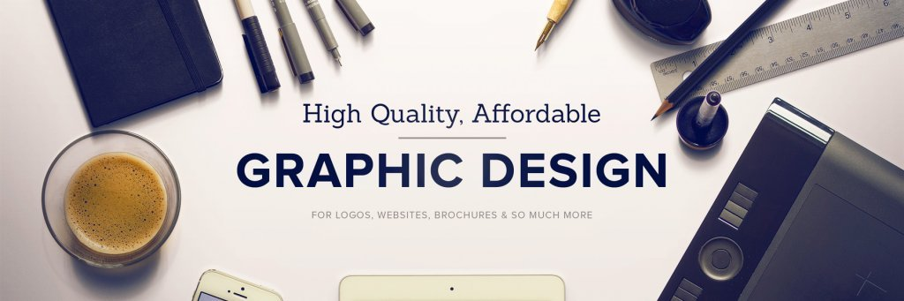

  

------------------------------------------------------------------------

## 📌 About This Repository

This repository contains multiple graphics design projects organized in one place.
It serves as a collection for learning, creative practice, portfolio showcase and real-world design examples.

### ✅ Included Projects

- **Business Card Design**  
  Business card concepts and layout designs.

- **Restaurant Menu Design**  
  Menu design layouts for restaurants.

- **Social Media Post**  
  Post designs for social media platforms.

- **Social Media Poster**  
  Poster-style creatives for campaigns and promotions.

- **Stationery Design**  
  Stationery branding items and mock designs.

------------------------------------------------------------------------

<table align="center" width="100%">
<tr>

<td width="33%" valign="top" style="padding:25px; border:1px solid #30363d;">

<h2>🎨 Software</h2>

- Adobe Photoshop  
- Adobe Illustrator  
- Canva  
- Fonts & Mockups  
- Color Palettes  

</td>

<td width="33%" valign="top" style="padding:25px; border:1px solid #30363d;">

<h2>✨Key Feature</h2>

- Clean Layout  
- Typography Focus  
- Branding Ready  
- Print Sizes  
- High-Res Export

</td>

<td width="33%" valign="top" style="padding:25px; border:1px solid #30363d;">

<h2>🎯 Purpose</h2>

- Design practice  
- Portfolio showcase  
- Skill development
- Real-world creatives  

</td>

</tr>
</table>

------------------------------------------------------------------------